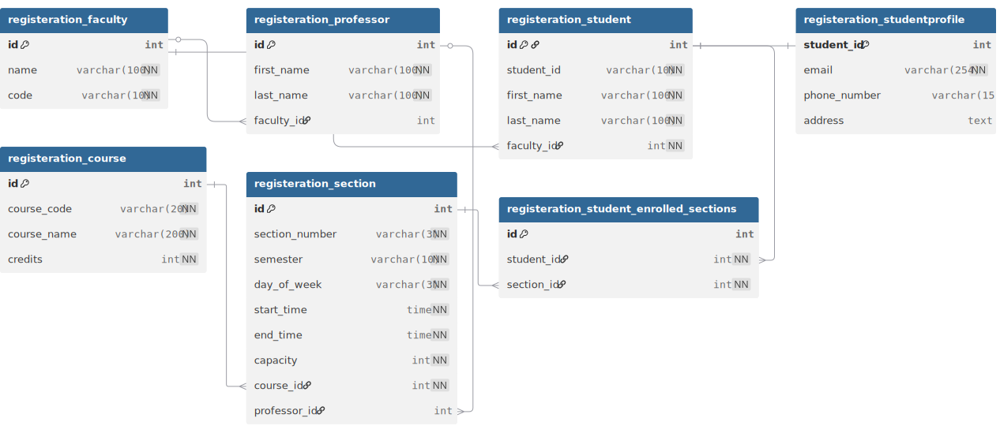
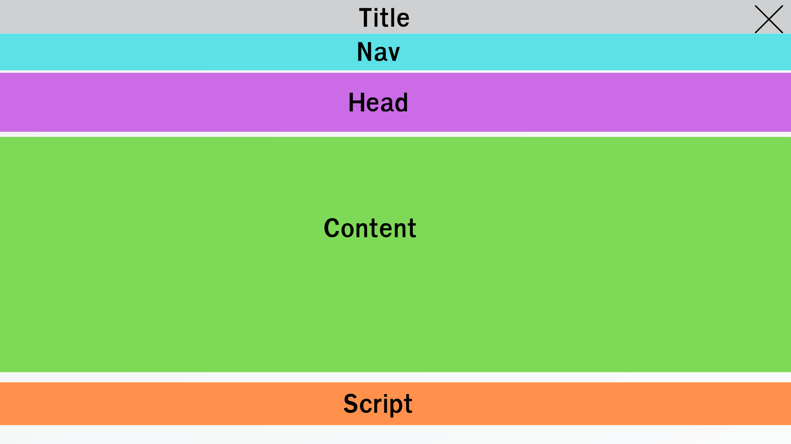
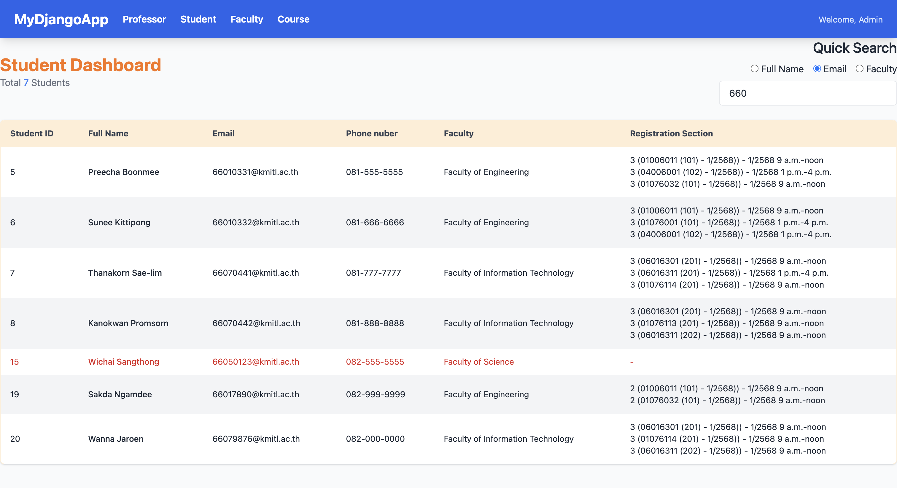

# WEEK 8 EXCERCISE


## Setup
> หากมี project ของ week 7 สามารถใช้ในการทำแบบฝึกหัดครังนี้ต่อได้ครับ (ข้ามข้อ 1-7)

1. สร้าง project ชื่อ `kmitl`
2. สร้าง database ใหม่ชื่อ `kmitl`
4. ให้ทำการ startapp ชื่อ `registration`
5. ให้ copy code ข้างล่างไปใส่ที่ไฟล์ `registration/models.py`

    ``` PYTHON
    from django.db import models


    class Faculty(models.Model):
        name = models.CharField(max_length=100, unique=True)
        code = models.CharField(max_length=10, unique=True)

        def __str__(self):
            return self.name


    class Professor(models.Model):
        first_name = models.CharField(max_length=100)
        last_name = models.CharField(max_length=100)
        faculty = models.ForeignKey(Faculty, on_delete=models.SET_NULL, null=True)

        def __str__(self):
            return f"{self.first_name} {self.last_name}"


    class Course(models.Model):
        course_code = models.CharField(max_length=20, unique=True)
        course_name = models.CharField(max_length=200)
        credits = models.PositiveSmallIntegerField()

        def __str__(self):
            return f"{self.course_code} {self.course_name}"


    class Section(models.Model):
        class DayOfWeek(models.TextChoices):
            MONDAY = "MON", "จันทร์"
            TUESDAY = "TUE", "อังคาร"
            WEDNESDAY = "WED", "พุธ"
            THURSDAY = "THU", "พฤหัสบดี"
            FRIDAY = "FRI", "ศุกร์"

        course = models.ForeignKey(Course, on_delete=models.CASCADE)
        section_number = models.CharField(max_length=3)
        semester = models.CharField(max_length=10)
        professor = models.ForeignKey(
            Professor, on_delete=models.SET_NULL, null=True, blank=True
        )
        day_of_week = models.CharField(max_length=3, choices=DayOfWeek.choices)
        start_time = models.TimeField()
        end_time = models.TimeField()
        capacity = models.PositiveSmallIntegerField(default=60)

        def __str__(self):
            return f"{self.course.course_code} ({self.section_number}) - {self.semester})"
            
        def dayOfWeek(self):
            weekday = {"MON": 0, "TUE": 1, "WED": 2, "THU": 3, "FRI": 4}
            return weekday[self.day_of_week]


    class Student(models.Model):
        student_id = models.CharField(max_length=10, unique=True)
        first_name = models.CharField(max_length=100)
        last_name = models.CharField(max_length=100)
        faculty = models.ForeignKey(Faculty, on_delete=models.PROTECT)
        # ความสัมพันธ์จะถูกย้ายมาอยู่ที่นี่
        enrolled_sections = models.ManyToManyField(Section, blank=True)

        def __str__(self):
            return f"{self.student_id} - {self.first_name}"


    class StudentProfile(models.Model):
        student = models.OneToOneField(Student, on_delete=models.CASCADE, primary_key=True)
        email = models.EmailField(unique=True)
        phone_number = models.CharField(max_length=15, blank=True, null=True)
        address = models.TextField(blank=True, null=True)

        def __str__(self):
            return f"Profile of {self.student.first_name}"
        
    ```

5. ให้ทำการ makemigrations และ migrate

6. ให้นักศึกษา run ไฟล์ kmitl_db.sql เพื่อ Insert ข้อมูลลง database

7. ให้นักศึกษาลากโฟลเดอร์ `templates` และ `templatetags` ใน excercise ไปไว้ที่โฟลเดอร์ `registration` ขอโปรเจคนักศึกษา
```sh
registration/
    - templates/
        - index.hmtl
        - nav.html
        - professor.html
        - course.html
        - faculty.html
    - templatetags/
        - custom_filter.py
```
9. ให้นักศึกษาลากโฟลเดอร์ `static` ใน excercise ไปใว้ในโฟลเดอร์ของโปรเจคนักศึกษา

```sh
static/
    - index.js
    - professor.js
    - course.js
    - faculty.js
```

## 1. Tamplate Inheritance
> นักศึกษาสามารถปรับปรุง view ของแบบฝึกหัด week7 มาใช้ร่วมกับแบบฝึกหัดครั้งนี้ได้

1.1 สร้างไฟล์ `layout.html` ในโฟลเดอร์ `templates` และกำหนด block ดังนี้ `title`, `head`, `nav`, `content`, `script` พร้อมเรียกใช้ไฟล์ script ในโฟลเดอร์ `static` และ include nav.html โดยจะมีโครงสร้าง Layout ของหน้าเว็บดังรูป (0.5 คะแนน)



1.2 ปรับปรุงไฟล์ html ในโฟลเดอร์ templates โดยให้ extends ไฟล์ `layout.html` และกำหนด code ภายใน block ให้เหมาะสมพร้อมแสดงผลให้ถูกต้อง

1.3 ให้นักนักศึกษาเรียกใช้ static ไฟล์ใน block `script` ให้สามารถใช้งาน function ได้ถูกต้อง โดยต้องลบแท็ก script ออกจากหน้า html แล้วไปใช้ของ static แทน

## 2. ปรับปรุงการแสดงผลข้อมูลในหน้าเว็บไซต์ โดยการใช้ template tag และ filter ของ django ให้ถูกต้อง

2.1 ให้นักศึกษาทำการแก้ไข URL ในทุกหน้าไปใช้ template tag `url` (0.25 คะแนน)

2.2 ในหน้า employee.html ให้ใช้ template tag `for ... empty` ในกรณีที่เป็นแถวแรก (`forloop.first`) และแถวสุดท้าย (`forloop.last`) ให้เปลี่ยนตัวอักษรเป็นสีแดง (0.25 คะแนน)

2.2 ให้นักศึกษาแสดงผลข้อมูลตารางพนักงานตามรูปภาพให้ถูกต้อง โดยให้มีการเรียงข้อมูลของพนักงานจากวันเริ่มงาน (Hire date) และแสดงผลลำดับการแสดงข้อมูลพนักงาน โดยการใช้ `filter` (0.25 คะแนน)
- Gender ถ้า M แสดง Male, F แสดง Female, Other
- วันเกิด, เริ่มงาน แสดงเป็น format 30/12/2024
- เงินเดือนทำให้แสดง comma ด้วยเช่น 1,000


